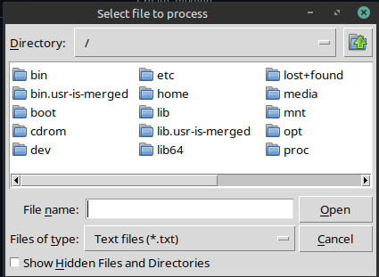
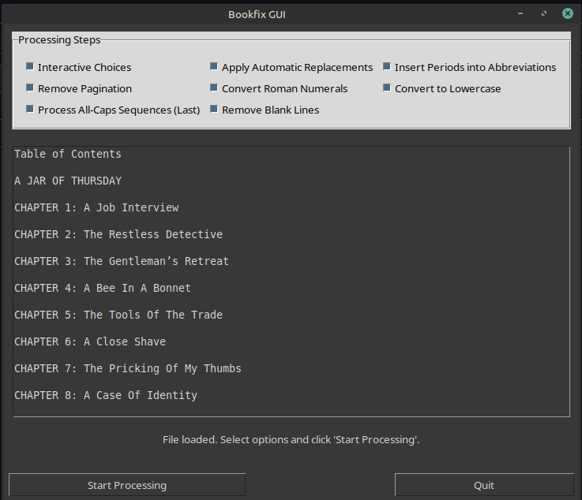
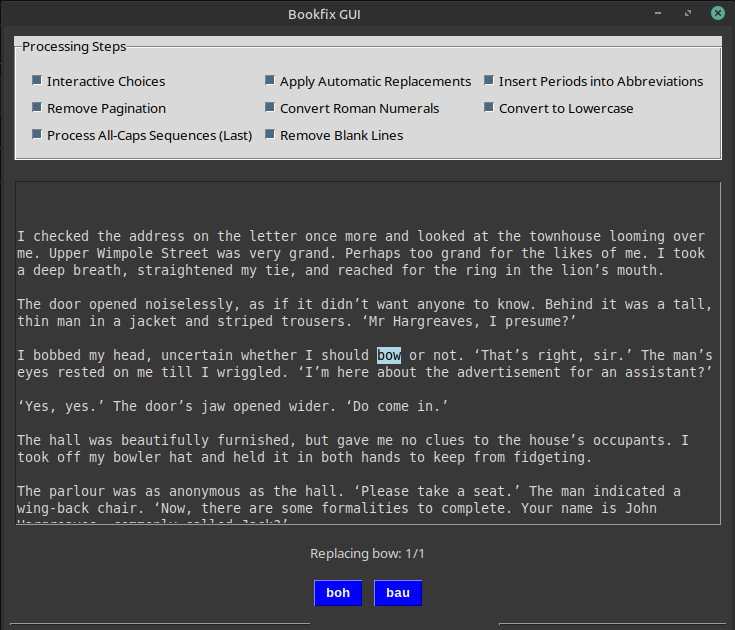

# TTS Ebook Preprocessing Tool (bookfix.py)

This is a small Python program designed to help preprocess ebook text files to fix common issues before using them for text-to-speech (TTS) or other applications. It provides a graphical interface to guide the user through interactive decisions and apply automatic cleanup rules.
    * **`#NOTE:`**: This program works on .txt files right now.  To work with ebooks code would need to be added to unzip and deconstruct the ebook and process each file.  The main problem I've encountered in this is dealing with the markup of the html files ebooks are mode of.  
    It's doable, I've done it in a different version, but it breaks easily as I use AI to program and AI alwalys wants to change or tinker or streamline code it's already written regardless of if it bears on what you are currently changing.

## NOTE:

This program is written in python and tested on a linux OS.  It uses text files (epub converted with calibre manually) but has in the past been modified to use epubs.  This required decompresisng the epub into it's html parts, then editing each file. It was doable and worked but getting the program to ignore the markup text was difficult and easily broken.  Thext is better and can be converted back to epub if you want.  The main reason is if you want chapters.  This sometimes works if chapters are marked with 'chapter #' otherwise no.  An audio file can have set timed interval "chapters" added to it though with some minimal effort.

## Synopsis

The `bookfix.py` script is a GUI tool built with the Tkinter library. Its main goal is to help users clean and standardize text from input files (like **.txt**, **.html**, and **.xhtml**), by providing a way to handle inconsistent wording and apply automatic cleanup rules.

The program guides the user through making decisions for specific words and then performs a series of automatic text transformations based on rules read from a separate data file.

## How it Works:

Key Features

* .data.txt file contains sections for data relating to certain functions below.  Simple text file which user may edit to add, change or delete entries. Simple format and intuitive.

* File selection window is opened at start up allowing user to select text file for processing.

* Main window is launched and user can select by checkbox which functions to trigger when Process button is clicked.  List of functions:

* Interactive Choices: Prompts the user to select replacements for specific words defined in the data file. (i.e. read, user can choose reed or red) 

* Automatic Replacements: Applies bulk find-and-replace rules. Replaces 3rd with third, Dr. with doctor, .45 with 45 (pistol) etc) 

* Pagination Removal: Strips page numbers from TXT and HTML (.xhtml/.html) files. Page numbers are defines as mumbers on a line by themselves.  Keeps numbers from being read outloud by TTS.

* Roman Numeral Conversion: Converts uppercase Roman numerals to Arabic numerals.  Search for valid strings of Roman numeral and converts them to common modern numerals.  Avoide converting I when it used as a personal pronoun.

* All-Caps Sequence Processing: Detects sequences of uppercase words such as STOP which might be spelled out instead of pronounced with empahasis.  User can select YES: changes word to lower case, No: leave it alone, Auto: Changes word to lowercase and all instances of it in document to
  lowercase. Further adds word to .data.txt so it's found and coverted prior to interactive query running - User only ever has to answer query about this word once.  All subsequent files will have it automatically converted. IGNOR: Leaves word unchanged, skips any other occurance of
  word in document. Adds word to .data.txt so it will never be queried again.

* Blank Line Cleanup: Optionally removes empty or whitespace-only lines. Might help improve pauses or strange vocalizations.

* Logging: Detailed timestamped logging to both stderr and an execution log file (bookfix_execution.log).

## Function Reference

Below is an enumeration of the main functions in the application, with brief descriptions of their responsibilities.

* center_window(win)

Centers a given Tk window on screen.

* log_message(message, level)

Writes timestamped log entries to stderr and a log file, flushing immediately.

* load_data_file()

Manually parses .data.txt into sections: choices, replacements, periods, default directory, ignore, uppercase-to-lowercase.

* save_default_directory_to_data_file(dir)

Updates or creates the # DEFAULT_FILE_DIR section in .data.txt.

* save_caps_data_file(ignore, lowercase)

Updates # CAP_IGNORE and # UPPER_TO_LOWER sections in .data.txt.

* select_file()

Opens a file dialog for selecting an input file, respecting the default directory.

* process_choices()

Interactive find-and-replace according to choices rules, with progress bar.

* highlight_current_match()

Highlights the next match in the text area for user confirmation.

* handle_caps_choice(choice)

Handles user input (y/n/a/i) for all-caps sequences: lowercase now, ignore, or auto-lowercase across the document and persist rules.

* process_all_caps_sequences_gui()

Two-pass processing of all-caps sequences: automatic pass based on persistent rules, then interactive pass with buttons and keyboard shortcuts.

* apply_automatic_replacements()

Performs simple string replacements defined under # REPLACE.

* insert_periods_into_abbreviations()

Inserts dots into abbreviations defined under # PERIODS.

* convert_to_lowercase()

Converts the entire text buffer to lowercase.

* roman_to_arabic(roman)

Converts a single Roman numeral string to its integer equivalent, validating format.

* convert_roman_numerals()

Finds and replaces Roman numerals in the text with Arabic numbers, line by line.

* remove_pagination()

Detects and removes pagination elements in TXT and HTML files, logs removed items.

* remove_blank_lines(text)

Returns text with empty or whitespace-only lines removed.

* run_processing()

Orchestrates the full workflow based on checkbox states, including interactive and automatic steps, and displays the Save button.

* start_processing_button_command()

Disables the Start button, resets UI, clears old logs, and invokes run_processing().

* update_text_area()

Refreshes the displayed text to match the in-memory text variable.

* update_status_label(msg)

Updates the status label text in the GUI.

* save_file()

Saves the processed text to a new file with an _output.txt suffix.

* display_save_button()

Makes the Save button visible after processing.

* quit_program()

Exits the application cleanly.# TTS Ebook Preprocessing Tool (bookfix.py)

